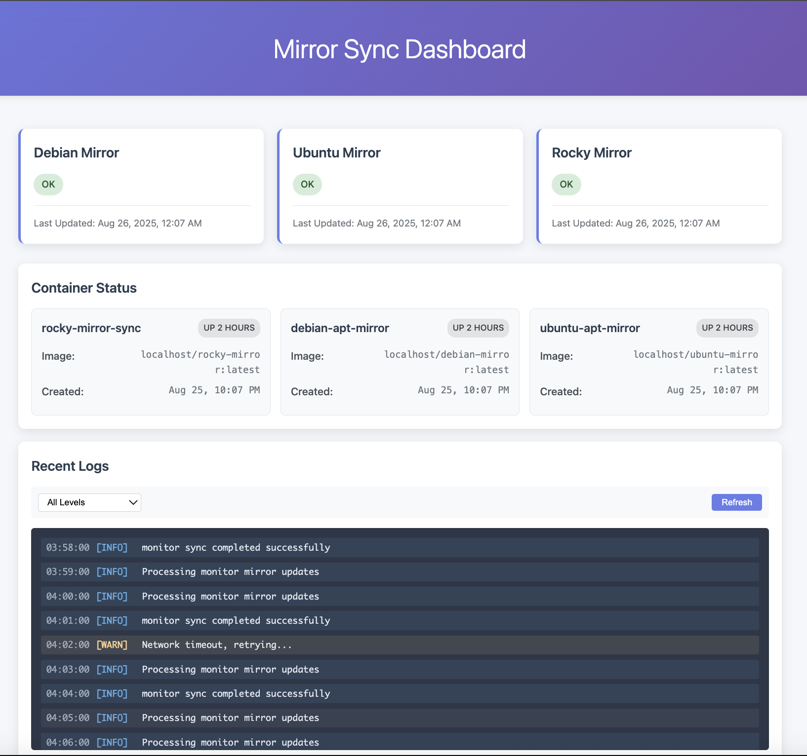

# Mirror Sync Project

A containerized Linux distribution mirror synchronization system with centralized configuration, monitoring, and automation.

## Overview

This project provides a modular, automated solution for synchronizing Linux distribution mirrors including **Debian**, **Ubuntu**, and **Rocky Linux**. It features centralized configuration management, comprehensive monitoring, resource management, and streamlined deployment.

### Supported Distributions

- **Debian** (bullseye, bookworm, trixie) - via `apt-mirror`
- **Ubuntu** (20.04, 22.04, 24.04, 25.04) - via `apt-mirror` 
- **Rocky Linux** (8, 9, 10) - via `dnf reposync`

## Architecture

The project follows a containerized approach with shared components:

1. **Shared Configuration** (`config/mirror-sync.conf`) - Centralized settings for all distributions
2. **Common Library** (`lib/common.sh`) - Shared functions for logging, container management, monitoring
3. **Base Container** (`base/Containerfile`) - Common base image for all mirrors
4. **Distribution-specific Containers** - Specialized containers with sync tools
5. **Build Scripts** - Automated container building and synchronization orchestration
6. **Systemd Integration** - Service units and timers for automated scheduling
7. **Monitoring System** - Health checks, notifications, and reporting

## Quick Start

### One-Click Setup (Recommended)

Get started immediately with the automated setup script:

```bash
# Clone the repository
git clone https://github.com/scohmer/mirror-sync.git
cd mirror-sync

# Run the one-click setup (checks requirements, creates directories, builds images, starts syncing)
./start

# Monitor progress
./scripts/monitor-mirrors.sh
```

The `start` script automatically:
- ✅ Checks system requirements (container runtime, tools)  
- ✅ Creates mirror and log directories with proper permissions
- ✅ Detects disk space and warns about storage requirements
- ✅ Builds all container images (Debian, Ubuntu, Rocky)
- ✅ Starts all repository syncs in the background
- ✅ Provides monitoring commands and next steps

**Available commands:**
```bash
./start                    # Complete setup and start syncing (default)
./start web               # Complete setup + launch web interface
./start web-only          # Start web interface only
./start web-stop          # Stop web interface
./start requirements       # Check system requirements only
./start directories        # Create directories only  
./start build             # Build container images only
./start sync              # Start repository syncs only
./start help              # Show all options
```

### Manual Setup

If you prefer step-by-step setup:

#### 1. Initial Setup

```bash
# Clone and enter the repository
cd mirror-sync

# Run complete setup
sudo ./scripts/setup-mirrors.sh all
```

### 2. Configuration

Edit local configuration:
```bash
sudo nano /opt/mirror-sync/config/local.conf
```

Example customizations:
```bash
# Mirror only specific versions
DEBIAN_SUITES="bookworm trixie"
UBUNTU_VERSIONS="22.04 24.04"
ROCKY_VERSIONS="9 10"

# Reduce resource usage
DEFAULT_THREADS="10"
DEBIAN_ARCHS="amd64"

# Enable notifications
ENABLE_NOTIFICATIONS="true"
NOTIFICATION_EMAIL="admin@example.com"
```

### 3. Enable and Start Services

```bash
# Enable timers for automated sync
sudo systemctl enable debian-apt-mirror.timer
sudo systemctl enable ubuntu-apt-mirror.timer
sudo systemctl enable rocky-apt-mirror.timer

# Start the timers
sudo systemctl start debian-apt-mirror.timer
sudo systemctl start ubuntu-apt-mirror.timer
sudo systemctl start rocky-apt-mirror.timer
```

### 4. Manual Sync (Optional)

```bash
# Run individual mirrors manually
sudo ./apt-mirror/debian-build-and-sync.sh
sudo ./apt-mirror/ubuntu-build-and-sync.sh
sudo ./rocky/rocky-build-and-sync.sh
```

## Configuration System

### Global Configuration (`config/mirror-sync.conf`)

- **Paths**: Mirror storage locations, log directories
- **Resources**: Memory/CPU limits, thread counts, timeouts
- **Distribution Settings**: Versions, architectures, components
- **Monitoring**: Disk thresholds, notifications
- **Cleanup**: Log retention, image cleanup policies

### Local Overrides (`config/local.conf`)

Override any setting from the global config without modifying the main file.

## Monitoring and Management

### Web Interface (Recommended)

For real-time monitoring with a modern dashboard:

```bash
# Launch web interface with mirrors
./start web

# Or start just the web interface
./start web-only
```

**Web Dashboard Features:**
- 🌐 **Real-time monitoring** at http://localhost:3000
- 📊 **Live mirror status** for Debian, Ubuntu, and Rocky Linux
- 🐳 **Container monitoring** with health status and logs
- 📜 **Live log streaming** with filtering and search
- 📱 **Responsive design** for mobile and desktop
- 🔄 **WebSocket updates** for instant status changes
- 📈 **System metrics** including disk usage and recent activity



The web interface provides:
- **Mirror Status Cards**: Real-time health indicators for each distribution
- **Container Dashboard**: Running containers with status, ports, and resource usage
- **Log Viewer**: Live streaming logs with level filtering (DEBUG, INFO, WARN, ERROR)
- **System Overview**: Disk usage, system load, and recent activity metrics

### Command-Line Monitoring

For traditional command-line monitoring:

```bash
# Check mirror health
./scripts/monitor-mirrors.sh check

# Generate comprehensive report
./scripts/monitor-mirrors.sh report

# Force send notifications
./scripts/monitor-mirrors.sh alert

# Clean up old logs and images
./scripts/monitor-mirrors.sh cleanup
```

### Logs

- **Build logs**: `$BASE_LOG_DIR/{debian,ubuntu,rocky}/build.log`
- **Sync logs**: `$BASE_LOG_DIR/{debian,ubuntu,rocky}/run.log`
- **Monitor reports**: `$BASE_LOG_DIR/mirror-status-report.txt`

### Health Checks

- Disk space monitoring (configurable threshold)
- Recent activity checks (files modified within 48 hours)
- Container status monitoring
- Systemd service status
- Network connectivity validation

## Features

### Resource Management
- Configurable memory and CPU limits for containers
- Disk space monitoring with alerts
- Process priority management (nice levels, IO scheduling)
- Concurrent run prevention via file locking

### Automation
- Systemd timer integration for scheduled syncs
- Automated container image cleanup
- Log rotation and retention management
- Error handling with notification support

### Web Interface & Monitoring
- **Real-time web dashboard** with Vue.js frontend
- **RESTful API** for status queries and integration
- **WebSocket connections** for live updates
- **Containerized deployment** with Docker Compose
- **Nginx reverse proxy** with security headers and rate limiting
- **Mobile-responsive design** for monitoring on any device

### Monitoring & Alerting
- Email notifications via system mail
- Slack webhook integration
- Comprehensive health reporting
- Container status monitoring
- Real-time web dashboard with live updates

### Security
- Non-root container execution where possible
- SELinux context management
- Proper file permissions and ownership
- Lock files to prevent concurrent execution

## Directory Structure

```
mirror-sync/
├── config/                 # Configuration files
│   ├── mirror-sync.conf   # Global configuration
│   └── local.conf         # Local overrides (created by setup)
├── lib/                   # Shared libraries
│   └── common.sh         # Common functions
├── base/                  # Base container image
│   ├── Containerfile     # Base image definition
│   └── healthcheck.sh    # Base health check
├── scripts/               # Management scripts
│   ├── setup-mirrors.sh  # Initial setup script
│   └── monitor-mirrors.sh # Monitoring script
├── web/                   # Web interface (NEW)
│   ├── backend/          # Node.js API server
│   │   ├── server.js     # Express server with WebSocket
│   │   ├── package.json  # Node.js dependencies
│   │   └── Containerfile # Backend container
│   ├── frontend/         # Vue.js dashboard
│   │   ├── src/          # Vue.js source code
│   │   ├── package.json  # Frontend dependencies
│   │   ├── Containerfile # Frontend container
│   │   └── nginx.conf    # Frontend nginx config
│   ├── nginx/            # Reverse proxy
│   │   ├── Containerfile # Nginx container
│   │   └── nginx.conf    # Proxy configuration
│   └── docker-compose.yml # Container orchestration
├── apt-mirror/            # Debian/Ubuntu mirrors
│   ├── deb.debian.org/   # Debian-specific container
│   ├── archive.ubuntu.com/ # Ubuntu-specific container
│   ├── debian-build-and-sync.sh
│   ├── ubuntu-build-and-sync.sh
│   ├── *.service         # Systemd service files
│   └── *.timer           # Systemd timer files
└── rocky/                 # Rocky Linux mirror
    ├── dl.rockylinux.org/ # Rocky-specific container
    ├── rocky-build-and-sync.sh
    ├── *.service         # Systemd service files
    └── *.timer           # Systemd timer files
```

## Migration from Original Design

The optimized version maintains backward compatibility while adding:

- **Centralized Configuration**: No more scattered environment variables
- **Shared Components**: Reduced duplication, consistent behavior
- **Enhanced Monitoring**: Proactive health checks and alerting
- **Real-time Web Interface**: Vue.js dashboard with live updates and WebSocket support
- **Better Resource Management**: Configurable limits and cleanup
- **Improved Error Handling**: Notifications and detailed logging
- **Standardized Rocky Support**: Full parity with Debian/Ubuntu features

Existing configurations will continue to work, but new features require the optimized framework.

## Troubleshooting

### Debug Menu System

The project includes a comprehensive debug menu system for troubleshooting:

```bash
./scripts/debug-menu.sh
```


The interactive menu provides:

**Framework Tests:**
- Basic framework validation (files, config, library loading)
- Configuration system testing
- Container runtime verification  
- Network connectivity checks

**Function Tests:**
- Lock mechanism validation
- Disk space checking
- Logging system verification
- Container image build testing

**Integration Tests:**  
- Step-by-step testing for each distribution (Debian, Ubuntu, Rocky)
- Full workflow validation
- Context and dependency verification

**System Information:**
- System status reports
- Container status and image listings
- Mirror directory analysis
- Log file examination

**Utilities:**
- Test lock cleanup
- Comprehensive health checks
- System diagnostics

### Quick Debug Commands

For specific issues, you can also run individual components:

```bash
# Quick framework check
source lib/common.sh && load_config && echo "Framework OK"

# Test specific distribution
./scripts/debug-menu.sh  # Then choose option 9, 10, or 11

# Check logs
tail -f /opt/mirror-sync/logs/{debian,ubuntu,rocky}/*.log
```

### Common Issues

1. **Permission Denied**: Ensure scripts are executable and SELinux contexts are correct
2. **Disk Space**: Monitor disk usage; sync operations require significant space
3. **Network Issues**: Check connectivity and firewall settings for repository access
4. **Container Build Failures**: Check container runtime installation and permissions
5. **Script Hangs or Does Nothing**: Use `./scripts/debug-menu.sh` for comprehensive diagnostics
6. **Lock File Issues**: Use debug menu option 16 to clean up test locks
7. **Configuration Problems**: Use debug menu options 1-2 for config validation

### Log Locations

- Service logs: `journalctl -u <service-name>`
- Container build logs: `$BASE_LOG_DIR/{distribution}/build.log`
- Sync operation logs: `$BASE_LOG_DIR/{distribution}/run.log`
- Debug analysis: Use debug menu option 15 for log file examination

### Getting Help

For comprehensive system diagnostics:
```bash
# Interactive debug menu
./scripts/debug-menu.sh

# Full health check (option 17 in menu)
# System status report (option 12 in menu) 

# Monitoring report
./scripts/monitor-mirrors.sh report
cat $BASE_LOG_DIR/mirror-status-report.txt
```

When reporting issues, include the output from the debug menu's health check (option 17).
